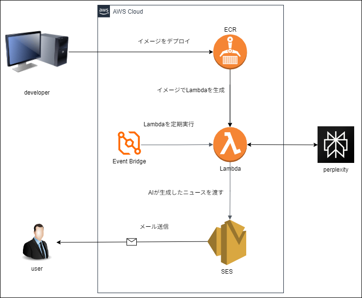

# AI 情報収集アプリ

## 概要

AI で今日の AI に関するニュースを生成して、ニュースをメールで配信するシステムです。

## システム構成図

本プロジェクトは、以下の構成図の Lambda 部分を担当します。



### システムに必要なもの

- AWS アカウント
- perplexity の API キー

## 送られてくるメールの例

### 本文

```txt
2025年1月19日です。

今日のAIに関する主なニュースは以下の通りです：

1. **バイデン大統領によるサイバーセキュリティ対策の発表**[1]：
   - バイデン大統領が退任間際にサイバーセキュリティ強化、ソフトウェア購入、AI利用に関する包括的な大統領令を発表しました。これにより連邦機関のサイバーセキュリティ強化が図られ、AIの防衛分野での活用が模索され、サイバー攻撃への制裁基準が引き下げられます。

2. **OpenAIの動向**[4]：
   - OpenAI社は、テキスト生成系AI「ChatGPT」や画像生成系AI「DALL-E」、音声生成系AI「Whisper」などのAIモデルを開発・公開しています。最近ではCEOであるサム・アルトマン氏の解任や社長の辞任により、混乱の渦中であることが報道されています。

3. **生成AIの進化**[2]：
   - 2024年の生成AIについて、10大テーマとして振り返ります。主要なテーマには、AIの超進化、生成AI価格競争の激化、生成AIツールの独自進化、企業での基本ツール化、そしてマルチモーダルの本格化などがあります。

4. **TikTokの米国事業と新法**[3]：
   - TikTokの米国事業を売却しない限り、米国内での利用を禁ずる新法が19日に発効します。パープレキシティはAIによる検索ツールを開発しています。

今日のAIニュースは、サイバーセキュリティ対策、OpenAIの動向、生成AIの進化など、AI関連の重要な話題を中心に広がっています。
```

## 開発環境

- OS: Linux
- エディター: vscode (cursor)
- コンテナ: docker

### テスト実行方法

vscode の Devcontainer 機能でコンテナを作成し、コンテナ内でテストを実行します。

事前に`npm install -g @devcontainers/cli`で Devcontainer の CLI をインストールしていれば、以下の make コマンドが使用できます。

- `make run` Devcontainer 起動
- `make stop` Devcontainer 停止

test は、vscode の Testing 機能で実行してください。

## デプロイ方法

### 前提

- AWS ECR にリポジトリが作成されていること（イメージのプッシュ先）
- aws cli をインストールし、profile を設定していること

### デプロイ手順

#### 初回

1. `.env.example`をコピーして、`.env`ファイルを作成する。
1. 以下の環境変数を設定する（内容は`.env.example`のコメント参照）。
   - APP_NAME
   - AWS_PROFILE
   - REGION
   - AWS_ECR_ACCOUNT
   - DEV_ECR_REPOSITORY_URI
1. `make build-dev`コマンドを実行して、docker image をビルドする。
1. （初回だけ）`push-dev-image-only`で image をプッシュする。
1. ブラウザで、AWS Lambda の画面を開いて、image から Lambda を作成する。このとき、環境変数`APP_NAME`で設定した名前にする。
1. 作成した Lambda に以下の環境変数を設定する（内容は`.env.example`のコメント参照）。
   - PERPLEXITY_API_KEY
   - EMAIL_SOURCE
   - EMAIL_DESTINATION

#### 2 回目以降

1. `make build-dev`コマンドを実行して、docker image をビルドする。
1. `push-dev`で image をプッシュする。Lambda 関数にも即座に image が適応される。

## トラブルシュート

### devcontainer の中で、test が実行できない。

解決方法：vscode の python 拡張機能が読み込めていないのが原因。vscode で開いたコンテナ画面を閉じて、再度開く。extensions を開いて、python の拡張機能が`reload window`になっていたらそのボタンを押して画面を開き直す。以上で test が実行できるはず。
